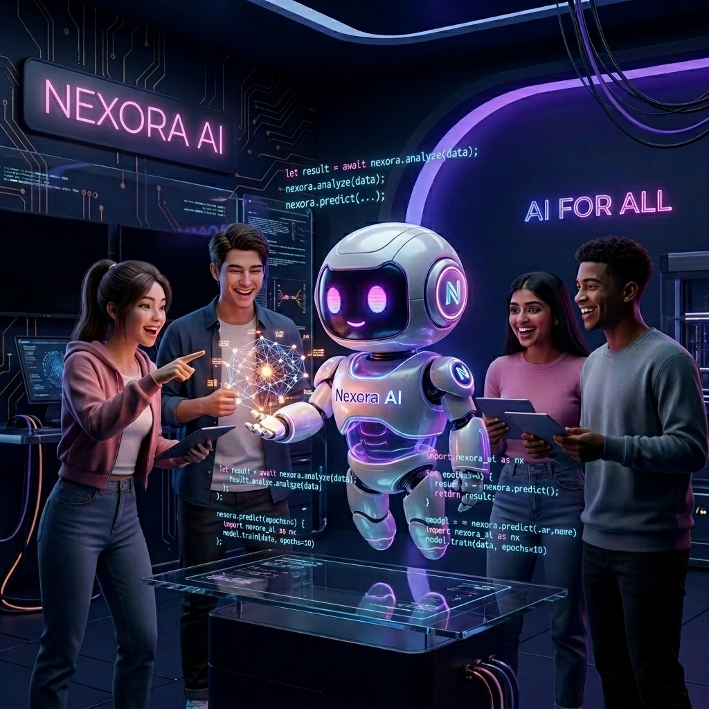

# Nexora AI | منصة نيكسورا التعليمية الذكية

<div align="center">
  
  
  <p>
    <b>English</b>: A modern, full-featured **AI-powered Learning Management System** built with React 19. This is the **frontend** layer of the graduation project — designed for high performance and seamless backend integration.
  </p>
  
  <p dir="rtl">
    <b>عربي</b>: منصة تعليمية حديثة ومتكاملة مدعومة بالذكاء الاصطناعي (LMS) مبنية باستخدام React 19. تمثل هذه المنصة الطبقة الأمامية (Frontend) لمشروع التخرج، وهي مصممة لتجربة مستخدم متميزة مع جاهزية تامة للربط مع أي خلفية برمجية.
  </p>

  <p>
    🚀 <b>Live Demo</b>: <a href="https://aitourgraduation.netlify.app">aitourgraduation.netlify.app</a>
  </p>
</div>

---

## ✨ Key Features | الميزات الرئيسية

| Feature (EN) | Description | الميزة | الوصف |
| :--- | :--- | :--- | :--- |
| **AI Video Assistant** | Contextual AI that pauses and explains concepts/code interactively | **مساعد فيديو ذكي** | ذكاء اصطناعي تفاعلي يشرح الأكواد والمفاهيم أثناء مشاهدة الفيديو |
| **AI Chat Tutor** | 24/7 interactive demo chat for student support | **معلم ذكاء اصطناعي** | دردشة تفاعلية لمساعدة الطلاب في أي وقت |
| **Multi-Role Access** | Dedicated dashboards for Student, Instructor, and Admin | **تعدد المهام** | لوحات تحكم مخصصة للطالب، المحاضر، والمدير |
| **Smart Quizzes** | Integrated learning check system within the curriculum | **اختبارات ذكية** | نظام اختبارات مدمج لتقييم تقدم الطلاب |
| **Arabic & English** | Full RTL/LTR localization support for global reach | **دعم ثنائي اللغة** | دعم كامل للغتين العربية والإنجليزية (RTL/LTR) |
| **3D Visuals** | Premium UI with Three.js/React Fiber animations | **تجربة بصرية متميزة** | واجهة مستخدم متطورة مع رسوميات ثلاثية الأبعاد |

---

## 🚀 Tech Stack | التقنيات المستخدمة

- **Frontend**: React 19 (Latest) & Vite
- **Styling**: Tailwind CSS v4 & Framer Motion (Animations)
- **3D Graphics**: Three.js & React Three Fiber
- **Localization**: i18next (Multi-language support)
- **Routing**: React Router DOM v7
- **Icons**: Lucide React

## 🤖 AI Capabilities | قدرات الذكاء الاصطناعي

### 1. AI Video Assistant (Smart Player)
The player detects pauses and offers to explain what's on screen. It can extract code snippets from the context and explain them step-by-step.
> يتفاعل مشغل الفيديو مع الطالب عند التوقف، ويقدم شروحات للمفاهيم البرمجية أو الأكواد المعروضة على الشاشة بشكل ذكي.

### 2. General AI Tutor
A global sidebar assistant available to answer technical questions and provide code examples in real-time.
> مساعد دائم متاح للإجابة على الأسئلة التقنية وتقديم أمثلة برمجية حية.

---

## 🌍 Localization (i18n) | دعم اللغات

The project is fully prepared for internationalization.
- **Arabic**: Supported with full RTL (Right-to-Left) layout.
- **English**: Supported with LTR layout.
- **Auto-detection**: Detects browser language automatically.

---

## 🛠️ How to Run | طريقة التشغيل

```bash
# 1. Install dependencies
npm install

# 2. Start development server
npm run dev

# 3. Build for production
npm run build
```

---

## 📂 Project Structure | هيكل المشروع

```text
src/
├── auth/           # Authentication context & protection
├── components/     # UI components (common, features, layout, ui)
├── context/        # Global state management
├── data/           # Mock DB & content
├── locales/        # Translation files (AR/EN)
├── pages/          # View components for all roles
├── services/       # API abstraction layer
└── utils/          # Helpers & formatters
```

---

## 🔗 Handoff & Integration | الربط البرمجي

This project is **100% ready** for production integration.
- 📘 **[API Integration Plan](./API_INTEGRATION_PLAN.md)**: Standardized schemas and endpoint mapping.

---

## 📄 License
This project is part of a graduation project and is for educational purposes.
